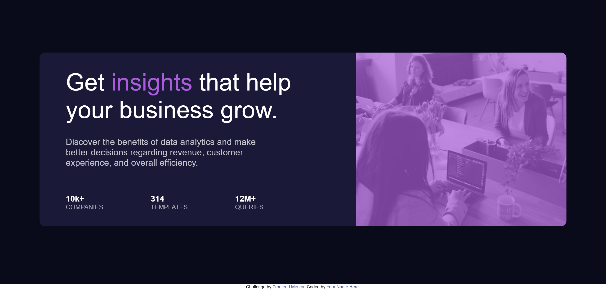

# Frontend Mentor - Stats preview card component solution

This is a solution to the [Stats preview card component challenge on Frontend Mentor](https://www.frontendmentor.io/challenges/stats-preview-card-component-8JqbgoU62). Frontend Mentor challenges help you improve your coding skills by building realistic projects. 

## Table of contents

- [Overview](#overview)
  - [The challenge](#the-challenge)
  - [Screenshot](#screenshot)
  - [Links](#links)
- [My process](#my-process)
  - [Built with](#built-with)
  - [What I learned](#what-i-learned)
  - [Continued development](#continued-development)
  - [Useful resources](#useful-resources)
- [Author](#author)
- [Acknowledgments](#acknowledgments)

## Overview

### The challenge

Users should be able to:

- View the optimal layout depending on their device's screen size

### Screenshot


 - Screenshot of the project

### Links

- Live Site URL: [Live Server URL](https://prasannapandhare.github.io/Stats-Preview-Card.github.io/)

## My process

### Built with

- Semantic HTML5 markup
- CSS custom properties
- Flexbox

### What I learned

I have learned how to make simple templates using HTML and CSS with help of flex properties and grid properties .

Observe below code for given project.

```html
<!DOCTYPE html>
<html lang="en">

<head>
    <meta charset="UTF-8">
    <meta name="viewport" content="width=device-width, initial-scale=1.0">
    <link rel="stylesheet" href="style.css">
    <link rel="icon" type="image/png" sizes="32x32" href="./images/favicon-32x32.png">
    <title>Frontend Mentor | Stats preview card component</title>
</head>

<body>

    <div id="wrapper">
        <div class="card">
            <div class="content">
                <div class="head">
                    <p>
                        Get <span>insights</span> that help your business grow.
                    </p>
                </div>
                <div class="para">
                    <p>
                        Discover the benefits of data analytics and make better decisions regarding revenue, customer
                        experience, and overall efficiency.
                    </p>
                </div>
                <div class="tag">
                    <div class="comp">
                        <div class="num">
                            10k+
                        </div>
                        <div class="name">
                            Companies
                        </div>
                    </div>
                    <div class="temp">
                        <div class="num">
                            314
                        </div>
                        <div class="name">
                            Templates
                        </div>
                    </div>
                    <div class="query">
                        <div class="num">
                            12M+
                        </div>
                        <div class="name">
                            Queries
                        </div>
                    </div>
                </div>
            </div>
            <div class="back">
                <p>
                    Aaaaaaaaaaaaaaaaaaaaaaaaaaaaaaaaaaaaa
                    aaaaaaaaaaaaaaaaaaaaaaaaaaaaaaaaaaaaa
                    aaaaaaaaaaaaaaaaaaaaaaaaaaaaaaaaaaaaa
                    aaaaaaaaaaaaaaaaaaaaaaaaaaaaaaaaaaaaa
                    aaaaaaaaaaaaaaaaaaaaaaaaaaaaaaaaaaaaa
                    aaaaaaaaaaaaaaaaaaaaaaaaaaaaaaaaaaaaa
                    aaaaaaaaaaaaaaaaaaaaaaaaaaaaaaaaaaaaa
                    aaaaaaaaaaaaaaaaaaaaaaaaaaaaaaaaaaaaa
                    aaaaaaaaaaaaaaaaaaaaaaaaaaaaaaaaaaaaa
                    aaaaaaaaaaaaaaaaaaaaaaaaaaaaaaaaaaaaa
                    aaaaaaaaaaaaaaaaaaaaaaaaaaaaaaaaaaaaa
                    aaaaaaaaaaaaaaaaaaaaaaaaaaaaaaaaaaaaa
                    aaaaaaaaaaaaaaaaaaaaaaaaaaaaaaaaaaaaa
                    aaaaaaaaaaaaaaaaaaaaaaaaaaaaaaaaaaaaa
                    aaaaaaaaaaaaaaaaaaaaaaaaaaaaaaaaaaaaa
                    aaaaaaaaaaaaaaaaaaaaaaaaaaaaaaaaaaaaa
                    aaaaaaaaaaaaaaaaaaaaaaaaaaaaaaaaaaaaa
                    aaaaaaaaaaaaaaaaaaaaaaaaaaaaaaaaaaaaa
                    aaaaaaaaaaaaaaaaaaaaaaaaaaaaaaaaaaaaa
                    aaaaaaaaaaaaaaaaaaaaaaaaaaaaaaaaaaaaa
                    aaaaaaaaaaaaaaaaaaaaaaaaaaaaaaaaaaaaa
                </p>
            </div>
        </div>
    </div>

    <div class="attribution">
        Challenge by <a href="https://www.frontendmentor.io?ref=challenge" target="_blank">Frontend Mentor</a>.
        Coded by <a href="#">Your Name Here</a>.
    </div>
</body>

</html>
```
```css
@import url(https://fonts.google.com/specimen/Inter);
@import url(https://fonts.google.com/specimen/Lexend+Deca);

* {
    margin: 0;
    padding: 0;
    box-sizing: border-box;
    font-family: "Inter", sans-serif;
    font-weight: 400, 700;
    font-family: "Lexend Deca", sans-serif;
    font-weight: 400;
}

#wrapper {
    height: 100vh;
    width: 100%;
    overflow-x: hidden;
    background-color: hsl(233, 47%, 7%);
    display: flex;
    justify-content: center;
    align-items: center;
    padding-left: 100px;
    padding-right: 100px;
}

.card {
    height: 60%;
    width: 1440px;
    background-color: hsl(244, 38%, 16%);
    display: flex;
    border-radius: 15px;
    overflow: hidden;
}

.content {
    width: 60%;
    height: 100%;
    padding-left: 5%;
    padding-right: 5%;
    padding-top: 3%;
    padding-bottom: 3%;
}

.back {
    width: 40%;
    height: 100%;
    background-image: url(images/image-header-desktop.jpg);
    background-repeat: no-repeat;
    background-position-y: center;
    background-size: cover;
    position: relative;
    color: transparent;
}

.back::after {
    content: "";
    position: absolute;
    top: 0;
    left: 0;
    right: 0;
    bottom: 0;
    background-color: hsla(277, 64%, 61%, 70%);
    z-index: 0;
}

.head {
    display: flex;
    color: white;
    font-family: "Lexend Deca", sans-serif;
    font-size: 380%;
    font-weight: bolder;
}

span {
    color: hsl(277, 64%, 61%);
}

.para {
    padding-right: 20%;
    padding-top: 5%;
    font-size: 140%;
    color: hsla(0, 0%, 100%, 0.75);
}

.tag {
    color: white;
    display: flex;
    padding-top: 10%;
    padding-right: 25%;
    justify-content: space-between;
}

.num {
    font-family: "Lexend Deca", sans-serif;
    font-weight: bolder;
    font-size: 130%;
}

.name {
    color: hsla(0, 0%, 100%, 0.6);
    text-transform: uppercase;
    font-family: "Inter", sans-serif;
}

.attribution {
    font-size: 11px;
    text-align: center;
}

.attribution a {
    color: hsl(228, 45%, 44%);
    text-decoration: none;
}


@media screen and (width<=526px) {
    #wrapper {
        display: flex;
        flex-direction: column-reverse;
        justify-content: center;
        align-items: center;
        min-width: 375px;
        height: 100%;
        padding-left: 5%;
        padding-right: 5%;
        padding-top: 10%;
        padding-bottom: 10%;
    }

    .card {
        display: flex;
        flex-direction: column-reverse;
        height: 90%;
        width: 90%;
        border-radius: 15px;
    }

    .content {
        display: flex;
        flex-wrap: wrap;
        flex-direction: column;
        text-align: center;
        padding-left: 20%;
    }

    .para {
        padding-top: 20%;
        padding-bottom: -15%;
    }

    .tag {
        display: flex;
        flex-direction: column;
        padding-bottom: 10%;
        padding-top: 0%;
    }

    .back {
        width: 100%;
        height: 40%;
        background-image: url(images/image-header-mobile.jpg);
        background-repeat: no-repeat;
        background-position-y: center;
        background-position-x: center;
        background-size: cover;
        position: relative;
    }

    .back p {
        display: flex;
        justify-content: center;
        align-items: center;
        color: transparent;
    }

    .back::after {
        content: "";
        position: absolute;
        top: 0;
        left: 0;
        right: 0;
        bottom: 0;
        background-color: hsla(277, 64%, 61%, 70%);
        z-index: 0;
    }

    .name {
        padding-bottom: 20%;
    }

    .attribution {
        text-align: center;
        font-size: 9px;
    }
}

@media screen and (width<=375px) {

    #wrapper {
        display: flex;
        flex-direction: column-reverse;
        justify-content: center;
        align-items: center;
        min-width: 375px;
        height: 100%;
        padding-left: 5%;
        padding-right: 5%;
        padding-top: 10%;
        padding-bottom: 10%;
    }

    .card {
        display: flex;
        flex-direction: column-reverse;
        height: 90%;
        width: 90%;
        border-radius: 15px;
    }

    .content {
        display: flex;
        flex-wrap: wrap;
        flex-direction: column-reverse;
        text-align: center;
        padding-left: 20%;
    }

    .para {
        padding-top: 20%;
        padding-bottom: -15%;
    }

    .tag {
        display: flex;
        flex-direction: column;
        padding-bottom: 15%;
        padding-top: 0%;
    }

    .name {
        padding-bottom: 20%;
    }

    .back {
        width: 100%;
        height: 40%;
        background-image: url(images/image-header-mobile.jpg);
        background-repeat: no-repeat;
        background-position-x: center;
        background-position-y: center;
        background-size: cover;
        position: relative;
    }

    .back p {
        display: flex;
        justify-content: center;
        align-items: center;
        color: transparent;
    }

    .back::after {
        content: "";
        position: absolute;
        top: 0;
        left: 0;
        right: 0;
        bottom: 0;
        background-color: hsla(277, 64%, 61%, 70%);
        z-index: 0;
    }

    .attribution {
        text-align: center;
        font-size: 4px;
    }

}
```

### Continued development

I am trying to improve my skills in media queries.

### Useful resources

- [MDN Docs](https://developer.mozilla.org/en-US/) - Helped me in various learnings. 

## Author

- Website - [Prasanna Pandhare](https://www.your-site.com)
- Frontend Mentor - [@Prasannapandhare](https://www.frontendmentor.io/profile/Prasannapandhare)

## Acknowledgments

I understood the importance of CSS in designing HTML structure.
As well as understood about responsive websites.
